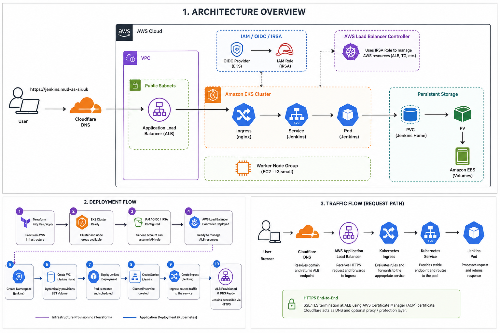
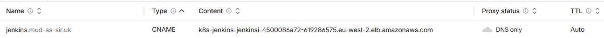
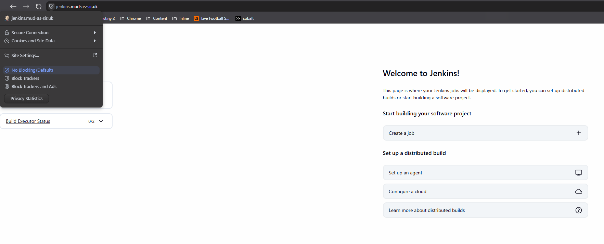
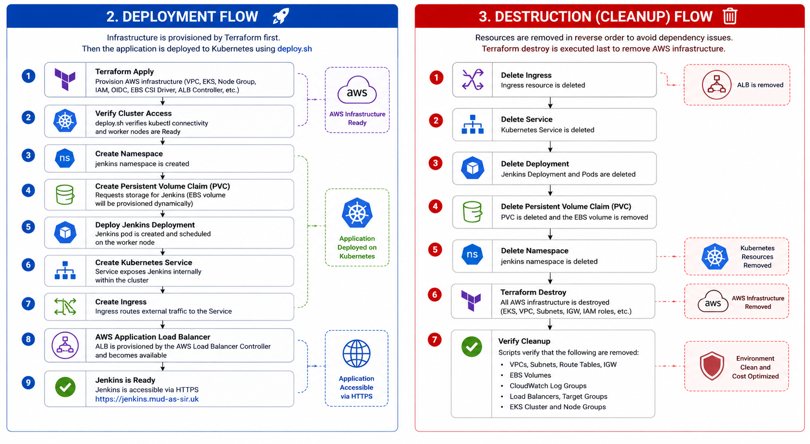
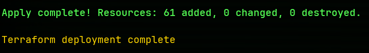
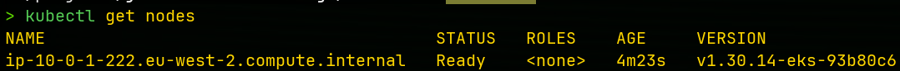
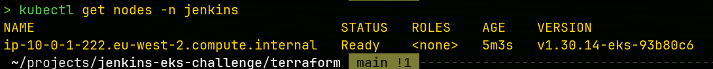
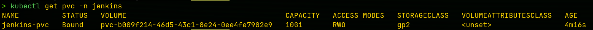
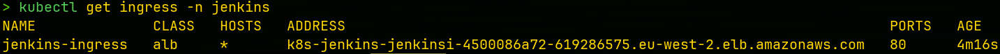
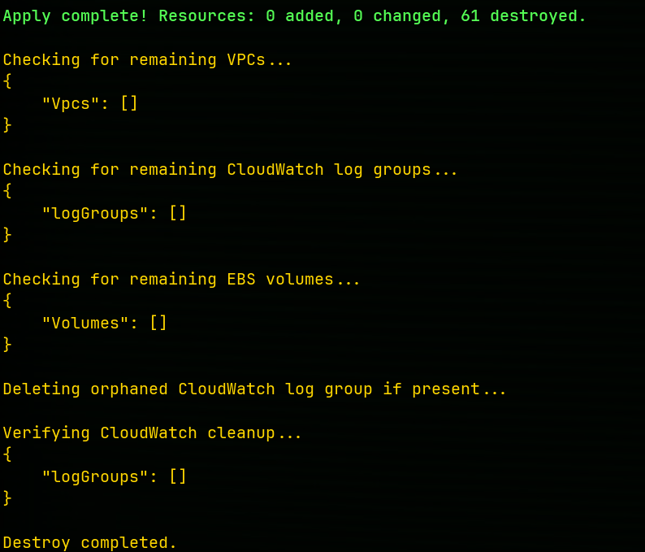

# Jenkins on Amazon EKS

A production-inspired Jenkins deployment on Amazon EKS using Terraform, Kubernetes and AWS services with automated deployment, persistent storage, HTTPS and Infrastructure as Code.

## Table of Contents

- [Project Overview](#project-overview)
- [Objectives](#objectives)
- [Architecture](#architecture)
- [Technologies Used](#technologies-used)
- [Infrastructure Components](#infrastructure-components)
- [Storage Lifecycle](#storage-lifecycle-jenkins-data-persistence)
- [Deployment Process](#deployment-process)
- [Environment Cleanup](#environment-cleanup)
- [Challenges & Troubleshooting](#challenges--troubleshooting)
- [Lessons Learned](#lessons-learned)
- [Future Improvements](#future-improvements)
- [Repository Structure](#repository-structure)
- [Deployment](#deployment)
- [Environment Destruction](#environment-destruction)
- [Author](#author)


---

## Project Overview

The goal of this project was to design, build, automate, and understand how Kubernetes, AWS, and Terraform work together to deploy, manage, and destroy a real-world application environment through Infrastructure as Code. The project focused on building a Jenkins platform on Amazon EKS that could be reliably recreated and removed using automated deployment and destruction scripts.

Throughout the build process, I gained hands-on experience with Kubernetes networking, persistent storage, IAM Roles for Service Accounts (IRSA), Application Load Balancers, Cloudflare DNS, and HTTPS certificate management using AWS Certificate Manager. The project also provided valuable troubleshooting experience, requiring me to investigate and resolve issues related to storage provisioning, AWS resource cleanup, ingress configuration, and infrastructure dependencies.

The end result is a small but practical cloud-native platform that demonstrates infrastructure automation, secure application delivery, persistent storage management, and full lifecycle testing from deployment through destruction.

---

## Architecture Overview

The following diagram illustrates the complete infrastructure and request flow for the project.



The deployment follows a layered architecture that separates infrastructure provisioning, networking, application routing, and persistent storage. Each layer has a dedicated responsibility, improving security, maintainability, and scalability while reducing manual configuration.

### Cloudflare DNS

The project uses Cloudflare to manage DNS records for the custom domain. The Jenkins subdomain points to the AWS Application Load Balancer using a CNAME record, allowing the application to be accessed through a memorable HTTPS endpoint.



### Jenkins Dashboard & HTTPS

Once deployed, Jenkins is accessible through the custom domain over HTTPS using an AWS Certificate Manager certificate.



---

## Objectives

This project was designed to:

- Learn Infrastructure as Code using Terraform
- Deploy Kubernetes workloads onto Amazon EKS
- Configure secure IAM authentication using IRSA
- Implement persistent storage using Amazon EBS
- Automate deployments using shell scripts
- Expose applications securely using an AWS Application Load Balancer
- Configure HTTPS using AWS Certificate Manager and Cloudflare
- Validate the complete deployment and destruction lifecycle
- Create a reusable foundation for future Kubernetes projects

---

## Architecture

The project follows a layered cloud-native architecture that separates infrastructure provisioning, networking, application routing, and persistent storage. Each component has a dedicated responsibility, improving maintainability, security, and scalability while reducing manual configuration.

### Request Flow

1. The user enters **https://jenkins.mud-as-sir.uk** into their browser.
2. Cloudflare resolves the domain name and directs traffic to the AWS Application Load Balancer.
3. The Application Load Balancer forwards the request to the Kubernetes Ingress.
4. The Ingress evaluates the routing rules and forwards traffic to the Jenkins Service.
5. The Service provides a stable internal endpoint and routes traffic to the Jenkins Pod.
6. The Jenkins Pod serves the application while storing persistent data through a Persistent Volume Claim backed by an Amazon EBS volume.

---

## Technologies Used

### Cloud & Infrastructure

- Amazon Web Services (AWS)
- Terraform
- Cloudflare

### AWS Services

- Amazon Elastic Kubernetes Service (EKS)
- Amazon Elastic Compute Cloud (EC2)
- Amazon Elastic Block Store (EBS)
- AWS Identity and Access Management (IAM)
- AWS Certificate Manager (ACM)
- Amazon CloudWatch
- AWS Application Load Balancer (ALB)

### Kubernetes Components

- Deployments
- Pods
- Services
- Ingress
- Namespaces
- Persistent Volumes (PV)
- Persistent Volume Claims (PVC)
- Storage Classes

### Security & Identity

- OpenID Connect (OIDC)
- IAM Roles for Service Accounts (IRSA)
- IAM Roles and Policies

### Tooling

- Helm
- kubectl
- AWS CLI
- Git
- GitHub
- Bash
- Visual Studio Code

---

## Storage Lifecycle (Jenkins Data Persistence)

The following diagram illustrates how Jenkins stores persistent data using Kubernetes Persistent Volumes and Amazon EBS.


Jenkins stores its application data on an Amazon EBS volume rather than inside the container itself. The Jenkins pod mounts a Persistent Volume Claim (PVC), which is dynamically bound to a Persistent Volume (PV) provisioned by the Amazon EBS CSI Driver.

This architecture ensures that application data survives pod restarts, updates, and rescheduling. Even if the Jenkins pod is deleted, Kubernetes automatically mounts the same Persistent Volume Claim to the replacement pod, allowing Jenkins to continue using the existing data without manual intervention.

## Deployment Process

The deployment and destruction lifecycle is illustrated below.



The project uses two custom automation scripts:

- **deploy.sh** provisions the Kubernetes application after Terraform creates the AWS infrastructure.
- **destroy.sh** removes Kubernetes resources before destroying the AWS infrastructure and verifies that no orphaned resources remain.

This workflow allows the environment to be deployed and destroyed consistently using repeatable automation while reducing manual intervention.

### Stage 1 - Infrastructure Provisioning

Terraform provisions and manages the AWS infrastructure required to support the Kubernetes environment, including:

- Virtual Private Cloud (VPC)
- Amazon EKS Cluster
- Managed Node Group
- IAM Roles and Policies
- OIDC Provider
- Amazon EBS CSI Driver
- AWS Load Balancer Controller

Terraform follows a predictable Infrastructure as Code workflow:

```bash
terraform fmt
terraform validate
terraform plan
terraform apply
```

This ensures infrastructure changes are reviewed before being applied and can be recreated consistently across deployments.

### Stage 2 - Application Deployment

Once the infrastructure has been successfully provisioned, the `deploy.sh` script automates the Kubernetes deployment.

The deployment script performs the following tasks:

- Verifies Kubernetes cluster connectivity
- Confirms worker nodes are ready
- Verifies the StorageClass
- Creates the Jenkins namespace
- Deploys the Persistent Volume Claim (PVC)
- Deploys the Jenkins Deployment
- Deploys the Kubernetes Service
- Waits for the Jenkins Pod to become ready
- Verifies the PVC has successfully bound to an Amazon EBS volume
- Deploys the Kubernetes Ingress
- Waits for the Application Load Balancer to become available
- Displays the final deployment status

This automation removes the need to manually execute Kubernetes commands while validating that each deployment stage completes successfully before continuing.

### Deployment Validation

#### Terraform Deployment



#### Kubernetes Worker Node



#### Running Jenkins Pod



#### Persistent Volume Claim



#### Kubernetes Ingress



---

## Environment Cleanup

The project includes an automated `destroy.sh` script that safely removes the Kubernetes application and AWS infrastructure while validating that resources have been cleaned up correctly.

The destruction process follows the reverse order of deployment to minimise dependency issues and reduce the risk of orphaned AWS resources.

The cleanup process performs the following actions:

- Deletes the Kubernetes Ingress
- Waits for the Application Load Balancer to be removed
- Deletes the Jenkins Service
- Deletes the Jenkins Deployment
- Deletes the Persistent Volume Claim
- Deletes the Jenkins namespace
- Waits for namespace removal
- Executes Terraform destroy
- Verifies that VPCs have been removed
- Verifies that Amazon EBS volumes have been removed
- Removes orphaned CloudWatch Log Groups if required
- Confirms infrastructure cleanup has completed

During development, additional validation steps were added after discovering orphaned Amazon EBS volumes and CloudWatch Log Groups following infrastructure destruction. These improvements increased confidence that the environment could be recreated from scratch without incurring unnecessary AWS costs.

### Cleanup Validation



---

## Challenges & Troubleshooting

Throughout the project, several real-world challenges were encountered that required investigation, testing, and iterative improvements. Rather than relying on manual intervention, these issues were analysed and resolved through automation wherever possible.

### IAM Roles for Service Accounts (IRSA)

One of the most significant challenges was configuring IRSA for the AWS Load Balancer Controller. Without the correct IAM role and trust relationship, the controller was unable to create and manage AWS resources such as Application Load Balancers and Target Groups.

The solution involved configuring an OIDC provider for the EKS cluster, creating a dedicated IAM role, and associating that role with the Kubernetes service account using IRSA. This allowed the controller to securely authenticate with AWS while following the principle of least privilege.

---

### Persistent Storage

Understanding Kubernetes persistent storage required learning the relationship between Persistent Volume Claims (PVCs), Persistent Volumes (PVs), and Amazon EBS volumes.

Testing confirmed that deleting a pod did not result in data loss because Jenkins stored its data on an Amazon EBS volume rather than inside the container itself. When Kubernetes recreated the pod, the existing volume was automatically reattached.

---

### Infrastructure Cleanup

During early testing, Terraform successfully destroyed the infrastructure but orphaned AWS resources occasionally remained, including Amazon EBS volumes and CloudWatch Log Groups.

To resolve this, additional verification and cleanup steps were incorporated into the `destroy.sh` script to ensure that resources were properly removed and unnecessary AWS costs were avoided.

---

### Deployment Validation

The deployment process was improved by introducing validation checks between each deployment stage.

Rather than assuming resources had been created successfully, the deployment script now verifies worker node readiness, Persistent Volume Claim binding, Application Load Balancer creation, Kubernetes Service creation, and Jenkins pod availability before proceeding to the next step.

---

## Lessons Learned

### Plan Before Building

Breaking the project into smaller objectives made it easier to visualise the final architecture, organise development tasks, and troubleshoot issues as they occurred. A structured plan reduced unnecessary complexity and kept development focused on the overall project goals.

### Track and Verify Resources

One of the biggest lessons from this project was the importance of validating infrastructure rather than assuming resources had been created or removed successfully. Discovering orphaned Amazon EBS volumes and CloudWatch Log Groups reinforced the need for automated verification during both deployment and destruction.

### Document Everything

Maintaining documentation throughout the project reinforced my understanding of the technologies being used while creating a valuable reference for future projects. Recording architectural decisions, troubleshooting steps, and improvements also helped identify opportunities for optimisation, including reducing infrastructure costs by moving from a t3.medium instance to a t3.small instance.

### Test Everything

Every major component of the project was tested throughout its lifecycle. Persistent storage, HTTPS connectivity, automated deployment, infrastructure destruction, and resource cleanup were all validated to ensure the environment behaved as expected under real deployment conditions.

Testing both successful deployments and complete environment destruction gave me a much deeper understanding of infrastructure dependencies and reinforced the importance of validating every stage of the infrastructure lifecycle.

---

## Future Improvements

Although the project successfully achieved its objectives, there are several enhancements that could be implemented in future iterations.

Future improvements include:

- Manage Cloudflare DNS records using the Terraform Cloudflare Provider to automatically update the Jenkins CNAME whenever a new Application Load Balancer is created.
- Automatically request and validate AWS Certificate Manager certificates through Terraform.
- Store Kubernetes manifests as Terraform resources for a fully Infrastructure as Code deployment.
- Implement GitHub Actions for Continuous Integration and Continuous Deployment (CI/CD).
- Introduce monitoring using Prometheus and Grafana.
- Collect application logs using CloudWatch Container Insights.
- Deploy multiple environments (Development, Staging, Production).
- Replace shell script automation with Terraform modules where appropriate.
- Improve security by integrating AWS Secrets Manager or External Secrets Operator.
- Implement Horizontal Pod Autoscaling for improved scalability.

---

## Repository Structure

```text
jenkins-eks-challenge/
│
├── bootstrap/
│   ├── main.tf
│   ├── providers.tf
│   ├── versions.tf
│   ├── terraform.tfstate
│   └── terraform.tfstate.backup
│
├── kubernetes/
│   └── jenkins/
│
├── screenshots/
│   ├── architecture-overview.png
│   ├── deployment-destruction.png
│   ├── storage-lifecycle.png
│   ├── cloudflare-dns.png
│   ├── deploy-success.png
│   ├── destroy-success.png
│   ├── jenkins-dashboard-https.png
│   ├── kubectl-get-ingress.png
│   ├── kubectl-get-nodes.png
│   ├── kubectl-get-pods.png
│   └── kubectl-get-pvc.png
│
├── terraform/
│   ├── main.tf
│   ├── providers.tf
│   ├── variables.tf
│   ├── outputs.tf
│   ├── iam.tf
│   ├── helm.tf
│   ├── deploy.sh
│   ├── destroy.sh
│   ├── jenkins-deployment.yaml
│   ├── jenkins-service.yaml
│   ├── jenkins-pvc.yaml
│   ├── jenkins-ingress.yaml
│   ├── iam_policy.json
│   └── test-pod.yaml
│
├── iam_policy.json
├── README.md
└── .gitignore
```

---

## Deployment

Deploy the complete environment:

```bash
cd terraform
chmod +x deploy.sh
./deploy.sh
```

The deployment script provisions the Kubernetes application after the AWS infrastructure has been created by Terraform and performs validation throughout the deployment process.

---

## Environment Destruction

Destroy the complete environment:

```bash
cd terraform
chmod +x destroy.sh
./destroy.sh
```

The destruction script removes Kubernetes resources before executing Terraform destroy and performs verification to ensure infrastructure has been cleaned up successfully.

---

## Author

**Mudassir**

This project was built as part of my DevOps portfolio to strengthen my understanding of Kubernetes, Terraform, AWS, Infrastructure as Code, and cloud-native application deployment. The focus of the project was not only to deploy an application but also to understand the reasoning behind each architectural decision, automate repetitive tasks, and validate the complete infrastructure lifecycle from deployment through destruction.